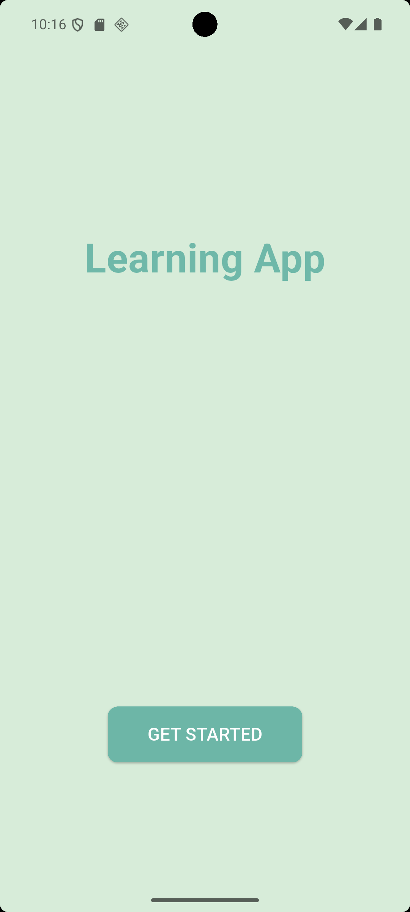
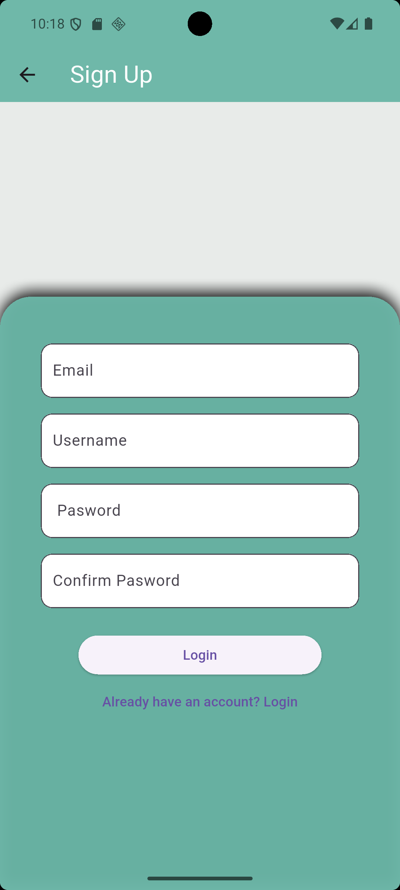
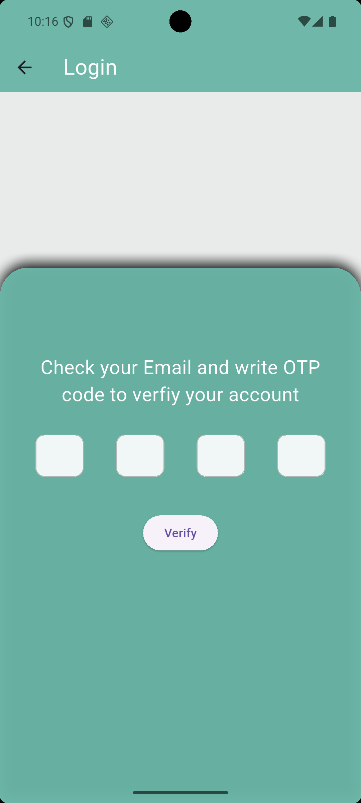
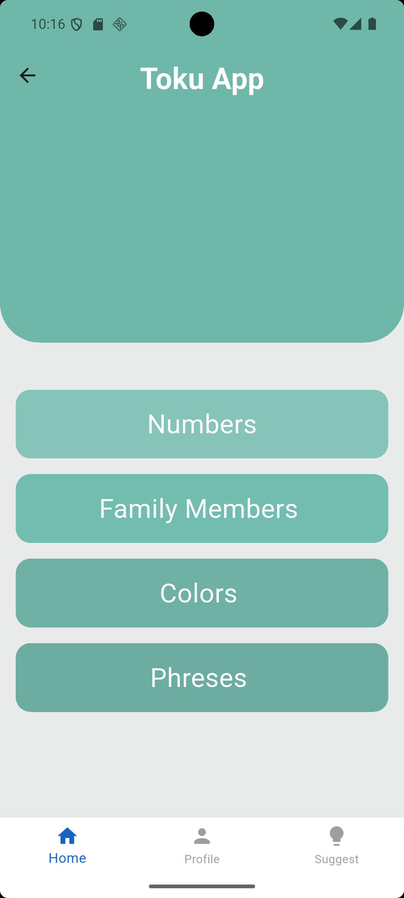
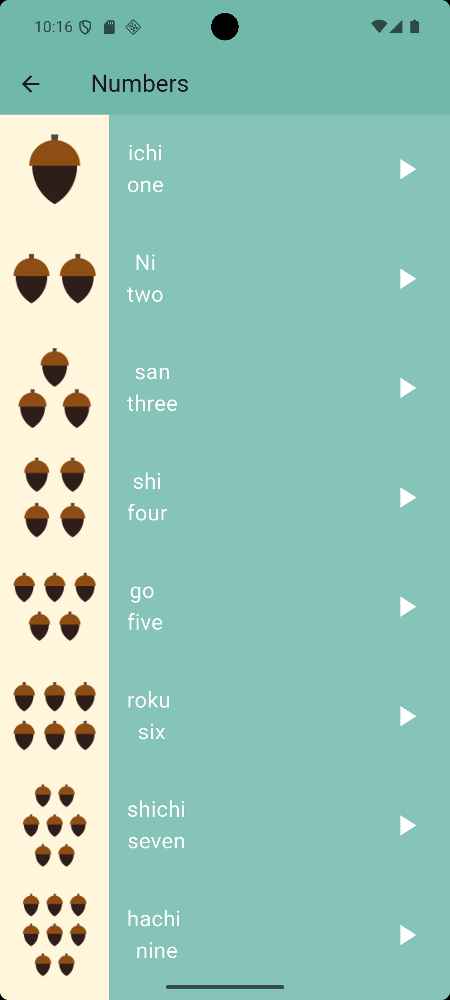
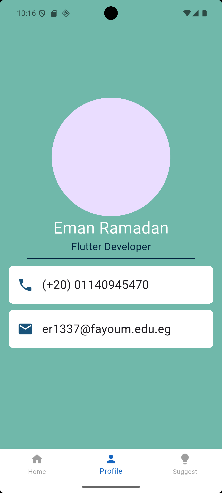

# Toku App

A kids-friendly language learning app built using Flutter.

This app includes multiple sections such as:
- Getting Started screen
- Login & Sign Up authentication
- OTP verification screen
- Language categories like Numbers, Colors, and more
- Profile page

## ✨ Screenshots

---

## 🚀 Getting Started

This project is a starting point for a Flutter application.

A few resources to help you start Flutter development:
- [Write your first Flutter app](https://docs.flutter.dev/get-started/codelab)
- [Flutter Cookbook](https://docs.flutter.dev/cookbook)
- [Flutter Documentation](https://docs.flutter.dev/)

---

## 📦 Project Structure Highlights

- `lib/Screens/`: contains all app screens (login, signup, OTP, etc.)
- `lib/Components/`: reusable widgets like buttons or styled containers
- `assets/`: includes screenshots and any media assets

---

## 🛠️ Technologies Used

- Flutter SDK
- Dart Language

---

## 📌 Notes

> This app is still under development. More screens and features coming soon!

